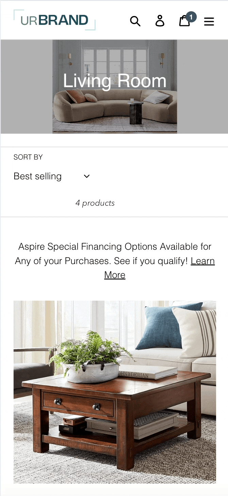
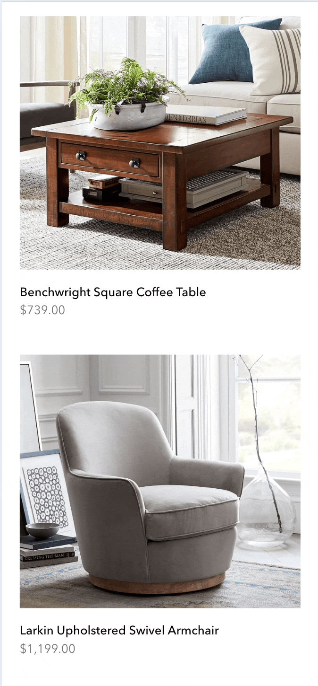
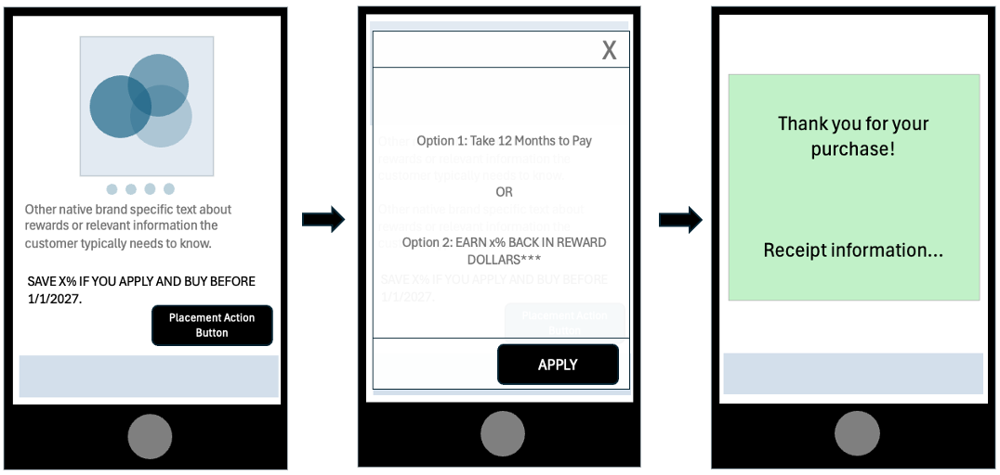
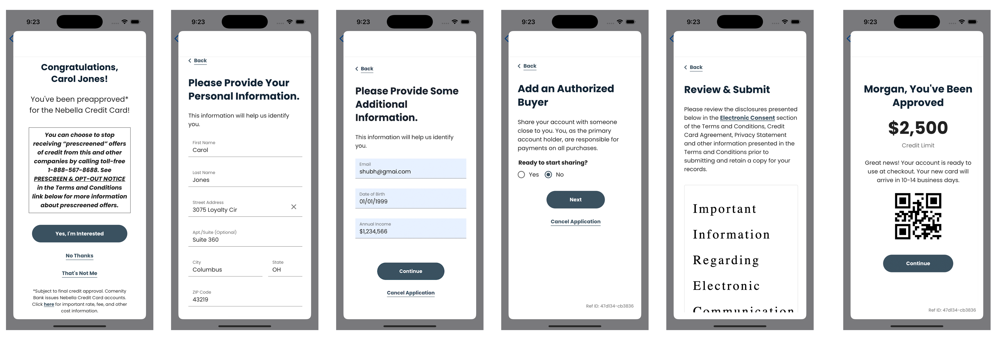
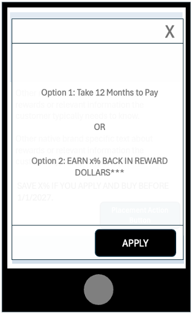
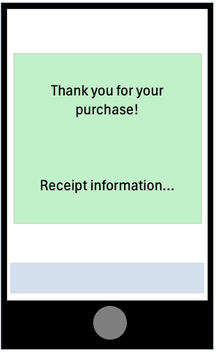

<p align="center">
  &nbsp;&nbsp;&nbsp; &nbsp;&nbsp;&nbsp;

</p>

# **Bread Partners SDK – iOS Library**  
[](https://github.com/getbread/breadfinancial-brand-partners-ios-swift/releases)

## **Overview of the Bread Financial Brand Partners SDK – Apply and Buy**  

The **Bread Financial Brand Partners Mobile Software Development Kit** (“SDK”) allows our Brand Partners to integrate **“Apply and Buy”** functionality within their app by using **User Interface** (“UI”) placements and a **Web View**. This functionality provided by the SDK will allow a customer to apply for credit to make a purchase within a brand partner’s native mobile app.

---

## Mobile SDK – High Level Procedural Steps

The iOS Mobile SDK allows you to utilize placement text, and an actionable button associated with the placement text. The button will then flow into the next stage of the process where a customer can apply for credit via a Web View that the mobile SDK makes available to complete the application. After a successful application and approval, a token will then be returned to the native mobile app to complete the checkout payment process.

<p align="center">
  
</p>

---

## iOS Mobile SDK Minimum Requirements

Ensure you have the following tools installed:

- **Xcode IDE** (version 16.2 or newer)
- **Swift Programming Language** (Version 5.0 or newer)
- **iOS Minimum Deployment Target** (15.0)

---

### Access The Bread Financial Brand Partners SDK

Currently, the **Brand Partners SDK** will be available only for brand partners that are part of the initial pilot group. It will be distributed directly to the brand partner’s identified technical resource.

### App Store Privacy and Compliance

We are committed to ensuring that our dependency in your app does not become your problem. We will make Apple and Google compliance and privacy changes as soon as the requirements are made publicly available so we can release an updated SDK to you as soon as possible.

### Bug Support

Please contact us at **BreadFinancialMobileSupport@breadfinancial.com** to let us know about any issues you encounter, along with a detailed description of what you encountered, what you are seeing in your mobile app analytics/logs, or any stack trace that you may have available.

### Sample App

A sample app will be provided with the SDK so that you can see the SDK in action, along with placement samples, and get the SDK integrated quicker.

### What’s New?

You can find a history of our changes in the SDK **[here](https://github.com/getbread/breadfinancial-brand-partners-ios-swift/blob/master/CHANGELOG.md)**.

We will provide a brief description of what issues were fixed and what new capabilities are enabled for consumption.

---

# Implementing the Bread Financial Mobile SDK

## High Level Overview of the SDK Process

- Implement the Brand Partners SDK via Swift Package Manager
- Initialize the SDK  
- Make a placement request and render the placement  
- Implement placement callback logic  
- After callback custom logic is implemented proceed to application and financing options within the Web View object  
- If credit is granted, an authorization token object will be returned from the Web View to be consumed and used at checkout for payment.

---

## Integrate iOS Mobile SDK via Swift Package Manager

To integrate `BreadPartnersSDK` into your Xcode project using Swift Package Manager (SPM), follow these steps:

#### a. Add the Package Dependency

1. Open your Xcode project.
2. Go to `File` > `Swift Packages` > `Add Package Dependency`.
3. In the prompt, enter the following repository URL:

   ```
   https://github.com/getbread/breadfinancial-brand-partners-ios-swift
   ```

4. Select the appropriate version (or branch) for your project.

5. Import the `BreadPartnersSDK` to whichever class you need to utilize the SDK in:

    ```swift
    import BreadPartnersSDK
    ```

---

## Initiating the SDK

Call the setup function at the app launch to initialize the SDK with the required configuration,

- `integrationKey` must be provided to identify the brand.  
- `environment` determines whether the SDK runs in development or production.  
- `enableLog` flag controls logging for debugging.

```swift
await BreadPartnersSDK.shared.setup(
    environment: BreadPartnersEnvironment.stage,
    integrationKey: brandId,
    enableLog: false)
```

---

## Making a Placement Request

To register a placement, you need to configure the placement data, UI styling, and merchant details before making the API request.

### 1. Define Placement Data

Create a `PlacementData` object to specify the financing type, order details, and placement ID. This includes subtotal, discounts, total price, shipping, tax, discount codes, and pickup information like name, phone, address, and email.

```swift
let placementData = PlacementData(
    financingType: BreadPartnersFinancingType.installments,
    locationType: BreadPartnersLocationType.category,
    placementId: "03d69ff1-f90c-41b2-8a27-836af7f1eb98",
    domID: "123",
    order: Order(
        subTotal: CurrencyValue(currency: "USD", value: 0),
        totalDiscounts: CurrencyValue(currency: "USD", value: 0),
        totalPrice: CurrencyValue(
            currency: "USD", value: Double(73900)),
        totalShipping: CurrencyValue(currency: "USD", value: 0),
        totalTax: CurrencyValue(currency: "USD", value: 0),
        discountCode: "string",
        pickupInformation: PickupInformation(
            name: Name(
                givenName: "John",
                familyName: "Doe"),
            phone: "+14539842345",
            address: Address(
                address1: "156 5th Avenue",
                locality: "New York",
                postalCode: "10019",
                region: "US-NY",
                country: "US"),
            email: "john.doe@gmail.com"),
        fulfillmentType: "type",
        items: []))
```

### 2. Configure

Pass the `placementData` inside a `PlacementConfiguration` object.

```swift
let placementsConfiguration = PlacementConfiguration(
    placementData: placementData
)
```

### 3. Set Up Merchant Information

Define the merchant and buyer details in `MerchantConfiguration`. This includes buyer information like name, birth date, email, phone, billing address, and optional shipping address. It also contains merchant-related data like store number, channel, and subchannel.

```swift
let merchantConfiguration = MerchantConfiguration(
    buyer: BreadPartnersBuyer(
        givenName: "Jack",
        familyName: "Seamus",
        additionalName: "C.",
        birthDate: "1974-08-21",
        email: "johncseamus@gmail.com",
        phone: "+13235323423",
        billingAddress: BreadPartnersAddress(
            address1: "323 something lane",
            address2: "apt. B",
            country: "USA",
            locality: "NYC",
            region: "NY",
            postalCode: "11222"
        ),
        shippingAddress: nil
    ), 
    loyaltyID: "xxxxxx",
    storeNumber: "1234567",
    channel: "P",
    subchannel: "X"
)
```

### 4. Register the Placement 

Call the registerPlacements method with the configured merchantConfiguration and placementsConfiguration. The splitTextAndAction flag determines how the text content is processed, and the forSwiftUI flag specifies whether the placement is being registered for a SwiftUI or UIKit based UI.

- `merchantConfiguration`: Provide user account details in this configuration.
- `placementsConfiguration`: Specify the pre-defined placement details required for building the UI.
- `splitTextAndAction`: Set this to true if you want the placement to return either text with a link or a combination of text and button.
- `forSwiftUI`: A Boolean flag indicating whether the text view should be created as a SwiftUI-compatible view.
- `callback`: A function that handles user interactions and ongoing events related to the placements.

```swift
await BreadPartnersSDK.shared.registerPlacements(
  merchantConfiguration: merchantConfiguration,
  placementsConfiguration: placementsConfiguration,
  splitTextAndAction: splitTextAndAction,
  forSwiftUI: true
) { event in
}
```

---

## Displaying an Overlay (Popup) without User Interaction

This method allows you to present an overlay (popup) directly to the customer without requiring any user interaction, such as clicking on a placement.

To trigger the overlay, you still need to configure the necessary placement and merchant details as you would for a normal placement. However, instead of rendering any text or button, this method immediately presents the overlay to the user.


### 1. Define Placement Data

Create a `PlacementData` object to specify the financing type, order details, and placement ID. This includes subtotal, discounts, total price, shipping, tax, discount codes, and pickup information like name, phone, address, and email.

```swift
let placementData = PlacementData(
    financingType: BreadPartnersFinancingType.installments,
    locationType: BreadPartnersLocationType.category,
    placementId: "03d69ff1-f90c-41b2-8a27-836af7f1eb98",
    domID: "123",
    order: Order(
        subTotal: CurrencyValue(currency: "USD", value: 0),
        totalDiscounts: CurrencyValue(currency: "USD", value: 0),
        totalPrice: CurrencyValue(
            currency: "USD", value: Double(73900)),
        totalShipping: CurrencyValue(currency: "USD", value: 0),
        totalTax: CurrencyValue(currency: "USD", value: 0),
        discountCode: "string",
        pickupInformation: PickupInformation(
            name: Name(
                givenName: "John",
                familyName: "Doe"),
            phone: "+14539842345",
            address: Address(
                address1: "156 5th Avenue",
                locality: "New York",
                postalCode: "10019",
                region: "US-NY",
                country: "US"),
            email: "john.doe@gmail.com"),
        fulfillmentType: "type",
        items: []))
```

### 2. Configure

Pass the `placementData` inside a `PlacementConfiguration` object.

```swift
let placementsConfiguration = PlacementConfiguration(
    placementData: placementData
)
```

### 3. Set Up Merchant Information

Define the merchant and buyer details in `MerchantConfiguration`. This includes buyer information like name, birth date, email, phone, billing address, and optional shipping address. It also contains merchant-related data like store number, channel, and subchannel.

```swift
let merchantConfiguration = MerchantConfiguration(
    buyer: BreadPartnersBuyer(
        givenName: "Jack",
        familyName: "Seamus",
        additionalName: "C.",
        birthDate: "1974-08-21",
        email: "johncseamus@gmail.com",
        phone: "+13235323423",
        billingAddress: BreadPartnersAddress(
            address1: "323 something lane",
            address2: "apt. B",
            country: "USA",
            locality: "NYC",
            region: "NY",
            postalCode: "11222"
        ),
        shippingAddress: nil
    ), 
    loyaltyID: "xxxxxx",
    storeNumber: "1234567",
    channel: "P",
    subchannel: "X"
)
```

### 4. Make the OpenExperienceForPlacement call

Call the openExperienceForPlacement method with the configured merchantConfiguration and placementsConfiguration. The forSwiftUI flag specifies whether the overlay (popup) is being registered for a SwiftUI or UIKit based UI.

- `merchantConfiguration`: Provide user account details in this configuration.
- `placementsConfiguration`: Specify the pre-defined placement details required for building the UI.
- `forSwiftUI`: A Boolean flag indicating whether the text view should be created as a SwiftUI-compatible view.
- `callback`: A function that handles user interactions and ongoing events related to the placements.

```swift
await BreadPartnersSDK.shared.openExperienceForPlacement(
    merchantConfiguration: merchantConfiguration,
    placementsConfiguration: placementConfiguration,
    forSwiftUI: true
) { event in
                
}
```

---

## Making a RTPS Request

To check if a user qualifies for a pre-screen card application, the brand partner's application needs to call the silentRTPSRequest method from the SDK. This process is completely silent, meaning there will be no visible UI changes for the user. The brand partner is only required to send the necessary metadata while the SDK handles the entire flow internally.

If any step in the RTPS (Real-Time Pre-Screen) flow fails, the user experience will remain unchanged, and no UI updates will be triggered. However, if the RTPS check succeeds, the SDK will invoke a callback, allowing the brand partner to display a popup with the "Approved" flow. The brand partner should listen for this callback and present the approval UI accordingly. 

### 1. Define RTPS Data

Create a RTPSData object to specify the location type, order details, and mockResponse type. Order includes subtotal, discounts, total price, shipping, tax, discount codes, and pickup information like name, phone, address, and email.

```swift
let rtpsData = RTPSData(
    order: Order(
        totalPrice: CurrencyValue(
            currency: "USD",
            value: 50000)
    ), locationType: BreadPartnersLocationType.checkout,
    mockResponse: BreadPartnersMockOptions.success
)
```

### 2. Configure UI & Styling:

Pass the placementData inside a PlacementConfiguration object.

```swift
let placementsConfiguration = PlacementConfiguration(
    placementData: rtpsData
)
```

### 3. Set Up Merchant Information

Define the merchant and buyer details in MerchantConfiguration. This includes buyer information like name, birth date, email, phone, billing address, and optional shipping address. It also contains merchant-related data like store number, channel, and subchannel.

```swift
let merchantConfiguration = MerchantConfiguration(
    buyer: BreadPartnersBuyer(
        givenName: "Carol",
        familyName: "Jones",
        additionalName: "C.",
        birthDate: "1974-08-21",
        billingAddress: BreadPartnersAddress(
            address1: "3075 Loyalty Cir",
            locality: "Columbus",
            region: "OH",
            postalCode: "43219")
    ),
    storeNumber: "2009"
)
```

### 4. Make the RTPS call

Call the silentRTPSRequest method with the configured merchantConfiguration and placementsConfiguration.

- `merchantConfiguration`: Provide user account details in this configuration.
- `placementsConfiguration`: Specify the pre-defined placement details required for building the UI.
- `splitTextAndAction`: Set this to true if you want the placement to return either text with a link or a combination of text and button.
- `forSwiftUI`: A Boolean flag indicating whether the text view should be created as a SwiftUI-compatible view.
- `callback`: A function that handles user interactions and ongoing events related to the placements.

```swift
await BreadPartnersSDK.shared.silentRTPSRequest(
  merchantConfiguration: merchantConfiguration,
  placementsConfiguration: placementsConfiguration
) { event in
}
```

### Flow Illustration.
<p align="center">
  
</p>

--- 

## Callback Event Types

The following is a list of callback events from the Register Placement and RTPS function:

```swift
/// Renders a text view containing a clickable hyperlink.
/// - Parameter textView: BreadPartnerLinkTextSwitUI to display the linked text for SwiftUI based UI.
case renderSwiftUITextViewWithLink(textView: BreadPartnerLinkTextSwitUI)

/// Renders text and a button separately on the screen for SwiftUI based UI.
/// - Parameters:
///   - textView: BreadPartnerTextView for displaying text.
///   - button: BreadPartnerButtonView for user interactions.
case renderSwiftUISeparateTextAndButton(
    textView: BreadPartnerTextView, button: BreadPartnerButtonView)

/// Renders a text view containing a clickable hyperlink.
/// - Parameter textView: BreadPartnerLinkText to display the linked text for UIKit based UI.
case renderTextViewWithLink(textView: BreadPartnerLinkText)

/// Renders text and a button separately on the screen for UIKit based UI.
/// - Parameters:
///   - textView: UITextView for displaying text.
///   - button: UIButton for user interactions.
case renderSeparateTextAndButton(textView: UITextView, button: UIButton)

/// Displays a popup interface on the screen.
/// - Parameter view: UIViewController that presents the popup.
case renderPopupView(view: UIViewController)

/// Detects when a text element is clicked.
/// This allows brand partners to trigger any specific action.
case textClicked

/// Detects when an action button inside a popup is tapped.
/// This provides a callback for brand partners to handle the button tap.
case actionButtonTapped

/// Provides a callback for tracking screen names, typically for analytics.
/// - Parameter name: name of the current screen.
case screenName(name: String)

/// Provides a success result from the web view, such as approval confirmation.
/// - Parameter result: result object returned on success.
case webViewSuccess(result: Any)

/// Provides an error result from the web view, such as a failure response.
/// - Parameter error: error object detailing the issue.
case webViewFailure(error: Error)

/// Detects when the popup is closed at any point and provides a callback.
case popupClosed

/// Provides information about any SDK-related errors.
/// - Parameter error: error object detailing the issue.
case sdkError(error: Error)

/// Provides information about any Card-related status.
/// - Parameter status: object detailing the status.
case cardApplicationStatus(status: Any)

/// Logs requests, responses, errors, and successes.
case onSDKEventLog(logs: String)
```

## Examples of dealing with Register Placement Callbacks

### 1. Render a TextView in UIKit

```swift
case .renderTextViewWithLink(let textView):

    /// Handles rendering of a text view with a clickable link.
    /// - Modifies the font, text color, and link color for the text view.
    /// - Adds the text view to the main view and sets up its layout constraints.

    textView.font = UIFont(
        name: fontFamily, size: Double(mediumTextSize))
    textView.textColor = UIColor.black
    textView.linkTextAttributes = [
        .foregroundColor: UIColor(hex: primaryColor)
    ]

    self.view.addSubview(textView)

    textView.translatesAutoresizingMaskIntoConstraints = false

    NSLayoutConstraint.activate([
        textView.centerXAnchor.constraint(
            equalTo: self.view.centerXAnchor),
        textView.topAnchor.constraint(
            equalTo: self.view.topAnchor, constant: 100),
        textView.leadingAnchor.constraint(
            equalTo: self.view.leadingAnchor, constant: 20),
        textView.trailingAnchor.constraint(
            equalTo: self.view.trailingAnchor, constant: -20),
    ])
```

### 2. Render a Text and Button View separately in UIKit

```swift
case .renderSeparateTextAndButton(let textView, let button):

    /// Handles rendering of a text view and a button, placed separately.
    /// - Modifies the font, text color for the text view, and the button's title color, font, and background.
    /// - Adds the text view and button to the main view and sets up their layout constraints.
    textView.font = UIFont(
        name: fontFamily, size: Double(mediumTextSize))
    textView.textColor = UIColor(hex: blackColor)

    button.setTitleColor(UIColor.white, for: .normal)
    button.titleLabel?.font = UIFont(
        name: fontFamily, size: Double(mediumTextSize))
    button.backgroundColor =
        UIColor(hex: primaryColor)
    button.layer.cornerRadius = 25.0

    DispatchQueue.main.async {

        self.view.addSubview(textView)
        self.view.addSubview(button)
        textView.translatesAutoresizingMaskIntoConstraints =
            false
        button.translatesAutoresizingMaskIntoConstraints = false

        NSLayoutConstraint.activate([
            textView.centerXAnchor.constraint(
                equalTo: self.view.centerXAnchor),
            textView.topAnchor.constraint(
                equalTo: self.view.topAnchor, constant: 100),
            textView.leadingAnchor.constraint(
                equalTo: self.view.leadingAnchor, constant: 20),
            textView.trailingAnchor.constraint(
                equalTo: self.view.trailingAnchor, constant: -20
            ),

            button.widthAnchor.constraint(equalToConstant: 150),
            button.trailingAnchor.constraint(
                equalTo: self.view.trailingAnchor, constant: -20
            ),
            button.heightAnchor.constraint(equalToConstant: 50),
            button.topAnchor.constraint(
                equalTo: textView.bottomAnchor, constant: 20),
        ])
    }
```

### 3. Render a Popup View in UIKit

```swift
case .renderPopupView(let view):
    DispatchQueue.main.async {
        /// Implement some process prior to loading the Web View popup
        /// (e.g checking if the customer is authenticated).

        self.showYesNoAlert(from: self) { userTappedYes in
            if userTappedYes {
                self.present(view, animated: true)
            } else {
                print("User canceled")
            }
        }
    }
```

### 4. Render a TextView in SwiftUI

```swift
VStack {
    if let textView = textView {
        textView
            .linkColor(.red)
            .linkFont("JosefinSans-Bold", fontSize: 18)
            .foregroundStyle(.gray)
            .font(.custom("JosefinSans-Bold", size: 16))

        Text(
            "Other native brand specitic text about rewards or relevant information the customer typically needs to know."
        ).padding(10)

    } else {
        Text("Loading text...")
    }
}
.onAppear {
    Task {
        await BreadPartnersSDK.shared.registerPlacements(
            merchantConfiguration: merchantConfiguration1,
            placementsConfiguration: placementsConfiguration1,
            splitTextAndAction: splitTextAndAction,
            forSwiftUI: true
        ) { event in
            switch event {
            case .renderSwiftUITextViewWithLink(let textView):
                self.textView = textView
            default:
                print("Event::\(event)")
            }
        }
    }
}
```

### 5. Render a Text and Button View separately in SwiftUI

```swift
@State private var textWithButton: (BreadPartnersTextView, BreadPartnersButton)?

var body: some View {
    VStack(alignment: .leading, spacing: 16) {
        if let textWithButton = textWithButton {
            textWithButton.0
                .textColor(.black)
                .font(.custom("JosefinSans-Bold", size: 16))

            textWithButton.1
                .font(.custom("JosefinSans-Bold", size: 16))
                .textColor(.white)
                .backgroundColor(.blue)
                .cornerRadius(8)
                .frame(maxWidth: .infinity, alignment: .trailing)

            Text("Other native brand-specific text about rewards or relevant information the customer typically needs to know.")
                .padding(.top, 10)
        } else {
            Text("Loading text...")
        }
    }
    .padding()
    .onAppear {
        Task {
            await BreadPartnersSDK.shared.registerPlacements(
                merchantConfiguration: merchantConfiguration1,
                placementsConfiguration: placementsConfiguration1,
                splitTextAndAction: true,
                forSwiftUI: true
            ) { event in
                switch event {
                case .renderSwiftUISeparateTextAndButton(let textView, let button):
                    self.textWithButton = (textView, button)
                default:
                    print("Event: \(event)")
                }
            }
        }
    }
}
```

### 6. Render a Popup View in SwiftUI

```swift
VStack {}
.onAppear {
    Task {
        await BreadPartnersSDK.shared.registerPlacements(
            merchantConfiguration: merchantConfiguration1,
            placementsConfiguration: placementsConfiguration1,
            splitTextAndAction: splitTextAndAction,
            forSwiftUI: true
        ) { event in
            switch event {
            case .renderPopupView(let view):
                sdkPopupView = view
                isPopupPresented = true
            default:
                print("Event::\(event)")
            }
        }
    }
}.onChange(of: sdkPopupView) { newPopupView in
    guard let popup = newPopupView else { return }
    showYesNoAlert { userTappedYes in
        if userTappedYes {
            presentPopup(popup)
        } else {
            print("User canceled")
        }
    }
}
```

## Register Placement Customization (Styling and display)

To give you flexibility in the layout that you use your placements in, you can request up to two UI objects – a `TextView` and a `Button`.

The text associated with the placement request. `(TextView)`

The action button associated the placement request. `(Button)`

### Flexibility for various layouts.

<p align="center">
  
</p>

--- 

## View Controller (Web View)

The `renderPopupView` callback provides a `UIViewController` instance from the SDK, which renders a WebView inside it. This **View Controller** is designed to display where the customer can apply for credit within your native mobile app. 

The SDK returns this `UIViewController` instance to the app, allowing the app to present the popup. The View Controller also includes its own set of event callbacks for handling interactions.

### Popup View.

<p align="center">
  
</p>

### The View Controller (Web View) Callbacks are listed below:

```swift
case /**Handle Other callback events**/
case .actionButtonTapped:
    print("BreadPartnerSDK::Popup action button was tapped!")
case .screenName(let name):
    print("BreadPartnerSDK::Screen name: \(name)")
case .webViewSuccess(let result):
    print("BreadPartnerSDK::WebView success with result: \(result)")
case .webViewFailure(let error):
    print("BreadPartnerSDK::WebView interaction failed with error: \(error)")
case .popupClosed:
    print("BreadPartnerSDK::Popup closed!")
case .sdkError(let error):
    print("BreadPartnerSDK::SDK encountered an error: \(error)")
case .cardApplicationStatus(status: Status):
    print("BreadPartnerSDK::Card Application Status: \(status)")
```

## Customer Application Status Event

To understand if the customer has been approved, declined, etc. you will have to listen to the Credit Application Status event callback. 

The responses available for the Credit Application Status are: 
- `APPROVED`
- `PENDING`
- `ACCOUNT_EXISTS`
- `DECLINED`
- `ERROR`

## Approved Credit Application Response Object

The response object that you receive from the SDK View Controller event callback once a customer has been approved looks like the example below:

```json
{
  "alternativePhone": "undefined",
  "applicationId": "516495689845349",
  "callId": "14766ff59402a765be2ffb714766ff59402a765be2ffb714766ff59402a765be2ffb714766ff59402a765be2ffb7",
  "cardType": "PL",
  "emailAddress": "shubh@gmai.com",
  "message": "Application successfully approved",
  "mobilePhone": "6143436666",
  "result": "APPROVED",
  "rewards": "undefined",
  "status": 200
}
```

## Token Usage at Checkout

Once the customer has been approved for credit and you have received the token object via the Web View callback event, you can then complete the transaction by making an account lookup up request through the SDK. The Account Lookup request will then provide you with the actual card information used during authorization. 

<p align="center">
  
</p>

---
